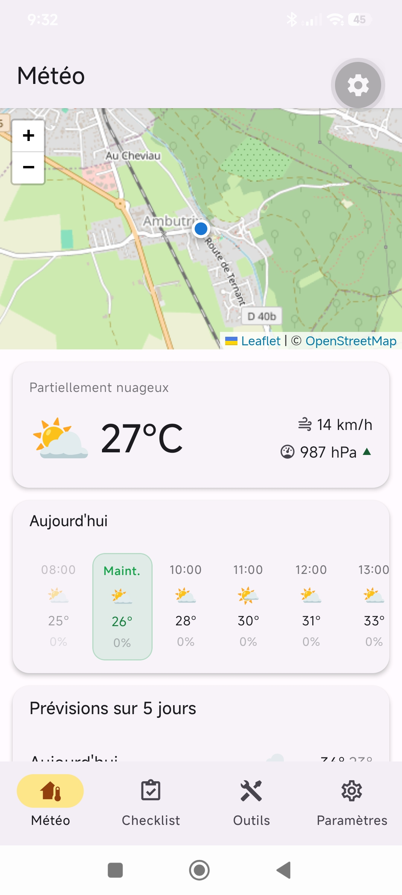
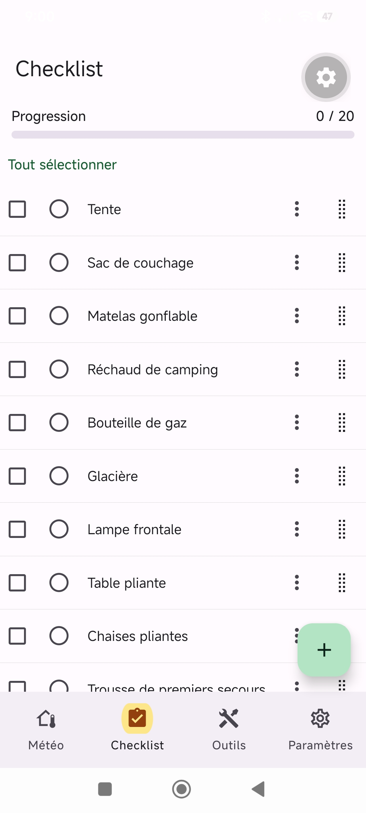
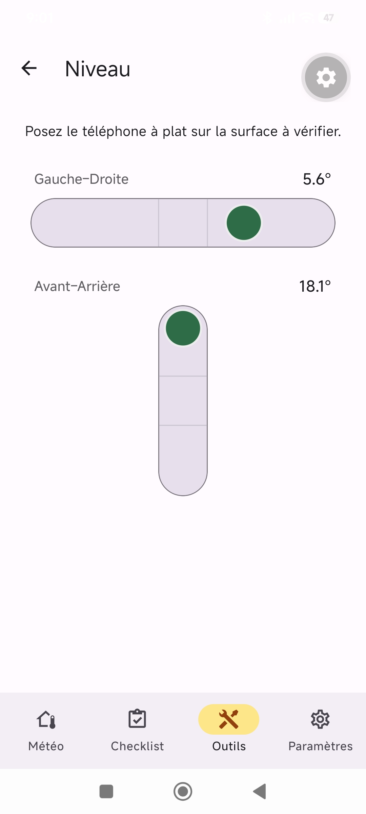

# Campingnard — application mobile

**L'application du campeur connecté**, en version mobile : météo, checklist de voyage, outils de
terrain (boussole, niveau, altimètre) et suivi de batterie, dans votre poche.

Application [Expo](https://expo.dev) / React Native qui consomme l'API JSON de l'
[application web Campingnard](../campingnard-app) (Symfony), avec authentification par compte
partagé entre le web et le mobile.

<p align="center">
  
  
  
</p>
<p align="center">
  
  
</p>

## Fonctionnalités

Toute l'application est protégée par connexion (compte commun avec le site web).

- **Équipements (checklist)** — parité complète avec le site web : création, génération à partir
  de préréglages, statut par article, actions groupées, réorganisation, filtres, édition.
- **Outils** :
  - **Météo** — pression + tendance 3 h et prévisions à 3 jours ([Open-Meteo](https://open-meteo.dev),
    nécessite une connexion).
  - **Soleil & Lune** — lever/coucher, midi solaire, golden hour, phase lunaire, calculés
    localement (hors ligne).
  - **Altimètre** — altitude GPS.
  - **Boussole** — cap magnétique (capteur magnétomètre).
  - **Niveau à bulle** — niveau deux axes (accéléromètre + retour haptique).
- **Entretien** — rappel de recharge de batterie (activation + fréquence en jours).
- **Paramètres** — langue (FR/EN, détection automatique de la langue de l'appareil).

## Stack technique

- **Expo** SDK 56 + **Expo Router** (routing par fichiers)
- **React Native** 0.85, **React** 19
- **UI** : react-native-paper (`BottomNavigation` à 4 onglets)
- **Auth** : JWT (LexikJWTAuthenticationBundle côté backend), stocké via `expo-secure-store`,
  rafraîchi automatiquement sur 401 (`src/auth/auth-context.tsx`)
- **Capteurs** : `expo-sensors` (accéléromètre, magnétomètre), `expo-location`, `expo-haptics`
- **i18n** : i18next / react-i18next (FR/EN)
- **Backend** : API Symfony du [projet web](../campingnard-app) (`src/Http/Api/Controller/`)

## Démarrage

1. Installer les dépendances :

   ```bash
   npm install
   ```

2. Lancer l'app :

   ```bash
   npx expo start
   ```

   Puis choisir une cible dans la sortie de la commande : development build, émulateur
   Android, simulateur iOS, [Expo Go](https://expo.dev/go), ou navigateur web
   (`npx expo start --web`).

3. Configurer l'URL de l'API backend si besoin — voir `src/constants/config.ts`
   (variable `EXPO_PUBLIC_API_URL`).
   ⚠️ Le backend tourne derrière FrankenPHP/Caddy : le certificat HTTPS local n'étant pas
   fiable pour React Native, pointer en HTTP (`http://localhost`, émulateur Android
   `http://10.0.2.2`, appareil physique `http://<IP-LAN>`).

## Architecture

```
src/
  app/                # Routes Expo Router (login, register, forgot-password, index)
  auth/                # AuthProvider / useAuth — session JWT
  api/                 # Client API (login, register, forgotPassword, refresh, apiFetch)
  components/          # main-tabs.tsx (BottomNavigation à 4 onglets)
  features/            # Écrans par onglet : checklist, tools, maintenance, settings
  i18n/                # Traductions FR/EN
  constants/           # Config (API_BASE_URL, …)
```

Tous les identifiants de code (dossiers, clés de route/onglet, clés i18n) sont en anglais ;
seules les valeurs de traduction affichées à l'utilisateur sont en français.

## Scripts

| Script            | Effet                          |
| ------------------ | ------------------------------- |
| `npm run start`    | `expo start`                    |
| `npm run android`  | `expo start --android`          |
| `npm run ios`      | `expo start --ios`              |
| `npm run web`      | `expo start --web`              |
| `npm run lint`     | `expo lint`                     |

## En savoir plus

- [Documentation Expo](https://docs.expo.dev/)
- [Expo Router](https://docs.expo.dev/router/introduction)
